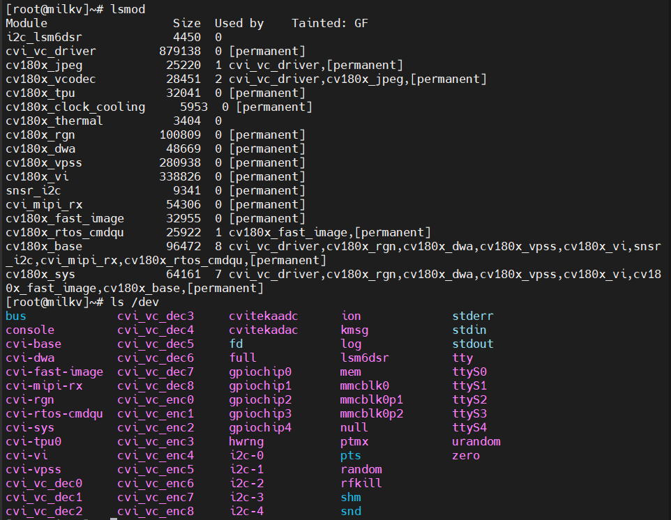
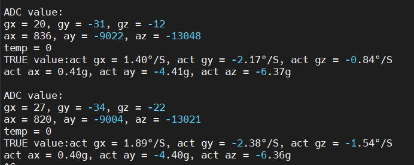

## 说明
- 使用i2c platform增加user driver

## 设备树
`build\boards\cv180x\cv1800b_milkv_duo_sd\dts_riscv\cv1800b_milkv_duo_sd.dts`
```
&i2c3 {
	status = "okay";
	lsm6dsr:lsm6dsr@6b {
		compatible = "litchicheng,lsm6dsr";
		reg = <0x6b>;
		status = "okay";
	};	
};
```

## 测试
### 模块和dev

### app测试输出

